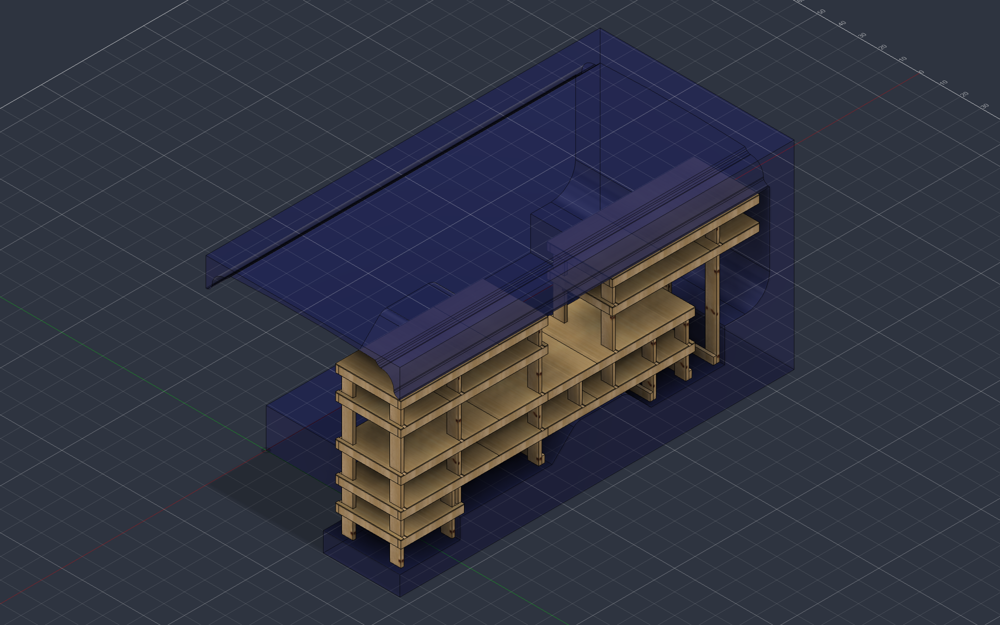
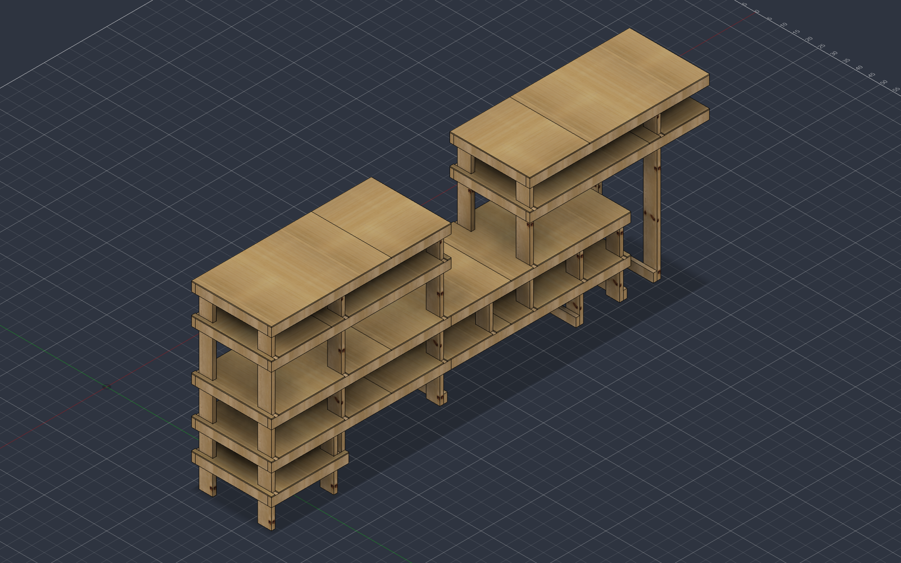
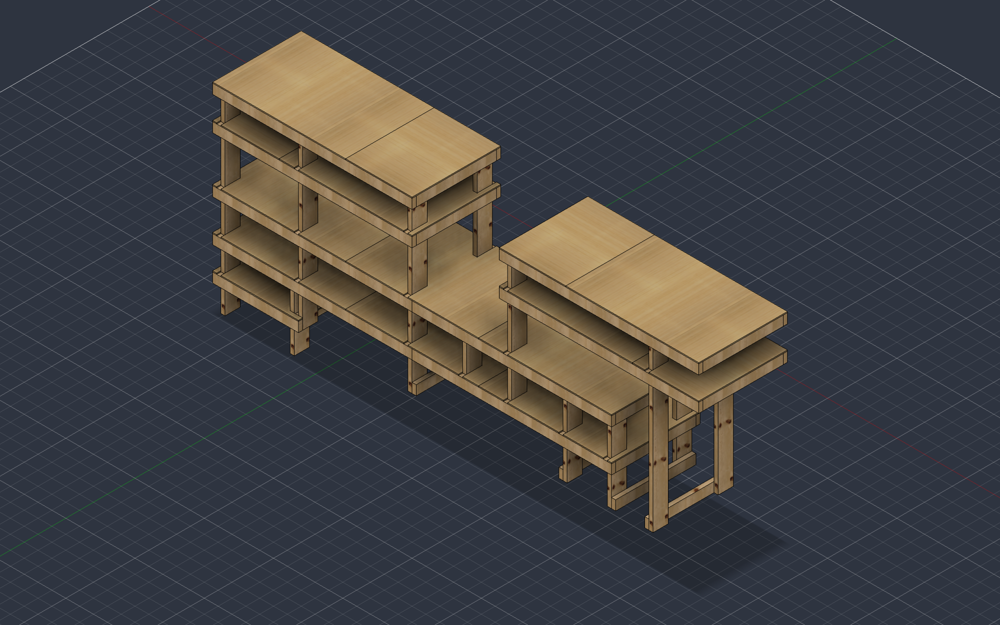
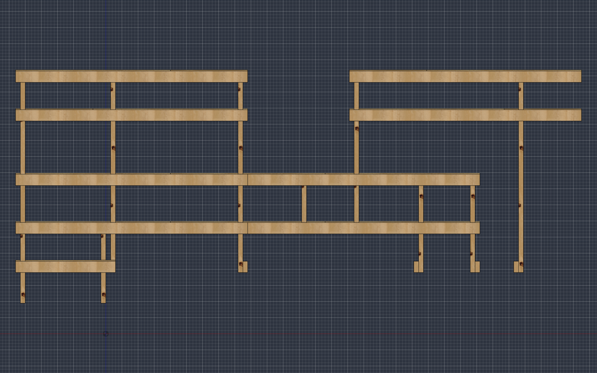
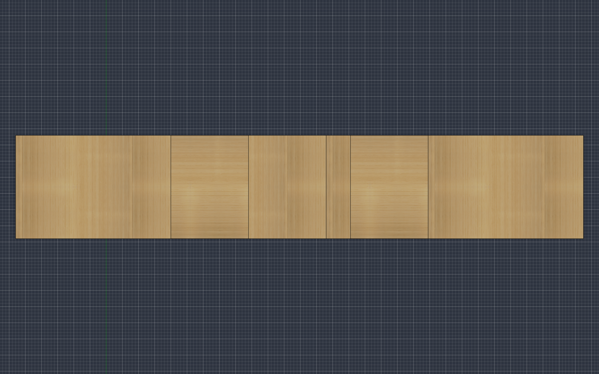

# Port-side shelves

Stick-framed shelving for the port (driver's) side of the Great Falls Tool Bus: 2×4 frames on 2×6 posts, decked with ⅜″ plywood. Three bays step up from a low 31″ entry step to a 72″-tall run, with the right-hand bay raised over the wheel arch. 175½″ long, 32″ deep, 72″ tall over the floor.



## Materials

| Stock | Qty | Notes |
| --- | --- | --- |
| 2×4 × 8 ft | 34 | 16 × 72″ rails, 52 × 29″ cross members, 2 × 31″ rails |
| 2×6 × 8 ft | 10 | 18 posts in 6 lengths |
| ⅜″ plywood, 4×8 | 5 | 15 panels, all 32″ deep; 2 strips spare |

Full cut list with per-board patterns, sheet layouts and a dimensioned drawing of every unique plywood panel: [`docs/cut_list.pdf`](docs/cut_list.pdf) (built from [`docs/cut_list.tex`](docs/cut_list.tex) →
`bazel build //bus_mods/jesssullivan/port_side_shelves/docs:cut_list` → `bazel-bin/.../cut_list.pdf`).

The stock plan is the exact cutting-stock optimum for 8-foot boards with ⅛″ kerf ([`docs/cutstock.py`](docs/cutstock.py)); the panel drawings are generated from the model ([`docs/ply_patterns.py`](docs/ply_patterns.py) over `docs/ply_outlines.json`).

## CAD

| File | What |
| --- | --- |
| `CAD/bus_hybrid_assy.f3d` | Fusion archive of the whole design (bus body + shelves) |
| `CAD/port_side_shelves.step` | The shelving assembly only |

The Fusion tree is organised for reuse: 21 part components (one per cut length / plywood shape) placed inside frame sub-assemblies, and identical frames are one component placed several times — Bay A's z 31/46/78 frames are a single component ×3, Bay B's z 31/46 frames a single component ×2. Edit a frame once and every level that uses it follows.

```
Port Side Shelves (Assembly)
├─ Posts (2x6)                        18 posts · 6 part types
├─ Bay A – Left        x −28..44      Frame A z19 · Frame A z31/z46/z78 ×3 · Frame A z66
├─ Bay B – Center low  x 44..116      Frame B z31/z46 ×2
├─ Bay C – Right high  x 75½..147½    Frame C z66 · Frame C z78
├─ Floor cleats z19                   3 × 2x4 x 29″
└─ Decks (3/8 ply)                    z 22½ · 34½ · 49½ · 69½ · 81½
```

## Images

| | |
| --- | --- |
|  |  |
|  |  |

## Build notes

- Cross members are 29″ = 32″ depth − two 1½″ rails. Rails are 72″ per bay; the low step is the only 31″ bay.
- Plywood is crosscut into three 32 × 48 strips per sheet; two kerfs leave the third strip at 31¾″ — use those for the 24″ panels and the 31″ step so the ten full shelves stay full depth.
- Plywood notches are drawn with dimensions in the cut list (every unique panel); still check against the installed posts before cutting.
- The 16 × 24″ 2×4 offcuts from the 72″ rails aren't used by this design — nothing here is shorter than 29″.

Cheers,
-Jess
